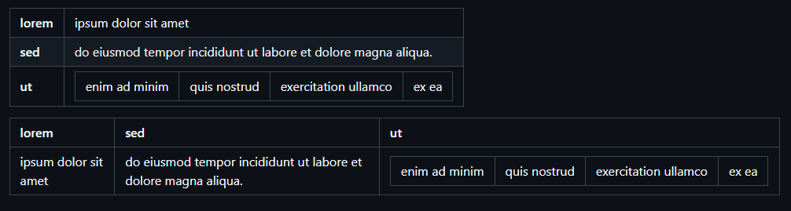
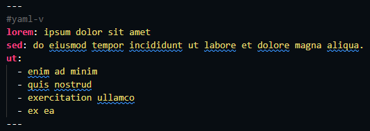
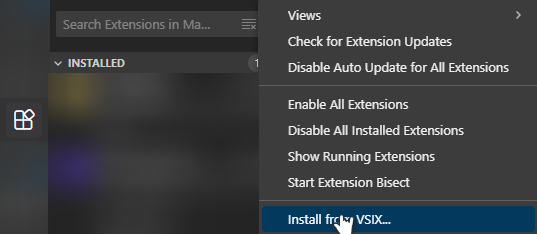

# VSCode markdown yaml frontmatter

Makes yaml front matter render as a table in VS Code's built-in markdown preview:



## Syntax



```markdown
---
#yaml
lorem: ipsum dolor sit amet
sed: do eiusmod tempor incididunt ut labore et dolore magna aliqua.
ut:
  - enim ad minim
  - quis nostrud
  - exercitation ullamco
  - ex ea
---
```

## Install

No marketplace planned, install from VSIX.

  
[download](markdown-yaml-frontmatter-0.1.0.vsix) or build yourself via `npx vsce package`

## Extras

- **#yaml-v** marker for vertical layout.
- custom markers & allow anywhere (so its not just a preamble, in any place table rendering also)
- backward compatibilitie with github yaml frontmatter rendering (it just ignore comments)
- highly configurable
